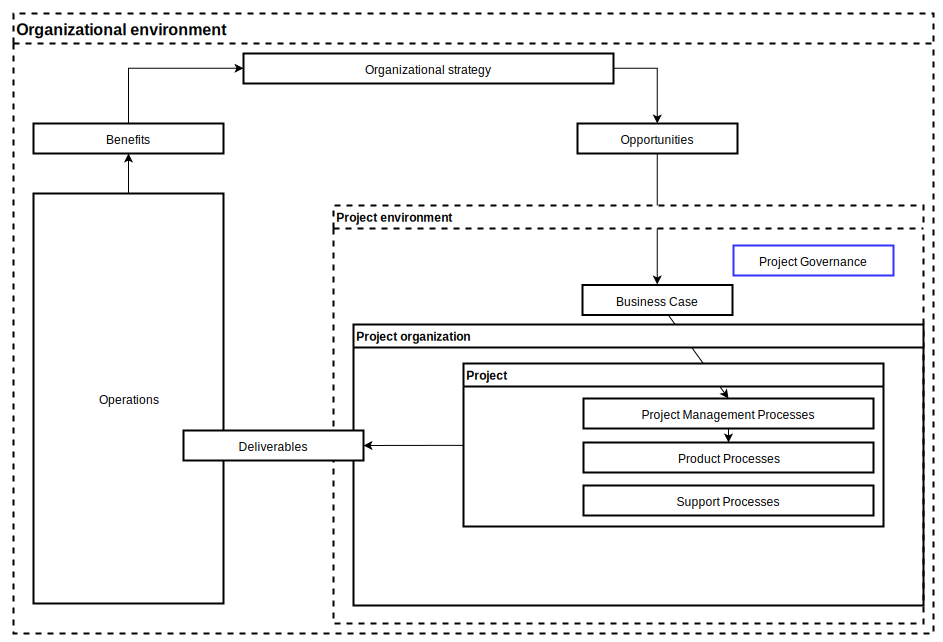
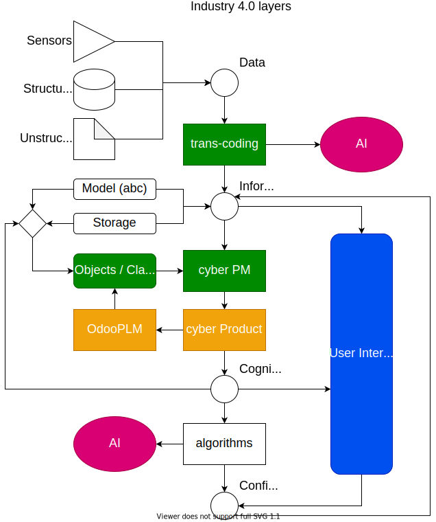

# Research case

This document narrates the case for undertaking a thesis as applied research within the threads relevant to the research portfolio of the pm-lab at digep

## Background

Key concepts driving this research

### A standard based approach to PM

[BS ISO 21500:2012 Guidance on project management](https://bsol-bsigroup-com.ezproxy.biblio.polito.it/Bibliographic/BibliographicInfoData/000000000030199186) provides a foundation to understand Project Delivery and Management as a set of processes.

The project framework provides for abstraction of those.

The iso21500 sees pm as a hierarchy of processes.
According to iso 9001 processes are defined as

>process: set of interrelated or interacting activities that use inputs to deliver output an intended product result

More in detail according to https://blog.processology.net/what-is-a-business-process

> What is a Business Process? A business process is defined as a collection of business tasks and activities that when performed by people or systems in a structured course, produce an outcome that contributes to the business goals. A business process includes at least one of, but not limited to, the following elements:

    task/ activity
    system
    employee(s)
    workflow
    data

Business processes are invented to derive and contribute to organizational goals. The continuous and repeated execution of business processes is pivotal to successful business operations and business growth.

Business process structures can be simple or complex, based on the elements involved in the process. Through every business process, a business strives to achieve certain goals.

### Project Economy

[PMI](https://www.pmi.org/the-project-economy) postulates that 

>“Project” is a huge, broad word that has such rich possibilities in terms of helping define how people do what they do and how organizations achieve their goals, create change, and deliver value. We are moving toward not defining work by its features or attributes, but in terms of what needs to get done, and figuring out the best way to do it. We call this [The Project Economy](ns_pmi_supp_sept_2019.pdf). 

Supposedly this radical transformation will eliminate the case for distinction between project and operations as stated in ISO above:
>3.7    Projects and operations
Project management fits within the general framework of management. Project management differs from other management disciplines by the temporary and unique nature of projects.Organizations perform work to achieve specific goals. Generally, this work may be categorized as either operations or projects. Operations and projects differ primarily as follows:
>* operations are performed by relatively stable teams through ongoing and repetitive processes and are focused on sustaining the organization;
>* projects are performed by temporary teams, are non-repetitive and provide unique deliverables

### Digital transformation

[Here](Definitions%20of%20digital%20transformation.md) we propose a collection of defintions.

Oprationally we will focus on [MIT Sloan](https://sloanreview.mit.edu/article/the-nine-elements-of-digital-transformation/) narrow view regarding transforming Operational Processes, i.e. process digitization, worker enablement, and performance management.

[Gartner](the-gartner-it-roadmap-for-digital-buisness-transformation-excerpt.pdf) has proposed an IT roadmap for digital business transformation

### PM4.0

In [previous research](https://www.researchgate.net/profile/Paolo-Demagistris/publication/347277259_Exploring_Industry_40_Paradigm_as_Applied_to_Project_Management_A_Proof_of_Concept/links/603ded064585154e8c6e1d68/Exploring-Industry-40-Paradigm-as-Applied-to-Project-Management-A-Proof-of-Concept.pdf) we made the case for applying the industry 4.0 to pm.

This work aims at implementing [Lee et al](https://doi.org/10.1016/j.mfglet.2014.12.001) proposed 5C architecture which is a 5 layer pyramidal architecture with layers for Smart Connection, Data to Information Conversion, Cyber Integration, Cognition and Configuration. They also provide a clear description of how to implement their framework. This paper is available [here](lee-et_al.pdf)

This is leading toward a redifined 5C framework that is in progress:

### Current limits on 5C adoption in PM - A case study

As PoliTO we are involved in a research project dealing among others with the aim of having **digital cognition** on financial flows related to the construction of a major public transport infrastructure. Also the aim is to provide **Configuration** on the future financial structure of the project to ensure its continuing financial viability.

This project could be addressed with the proposed approach. Alas:

* Data is provided through documents, either as unstructured text or pseudo-structured excel spreadsheets.
* Data is actually formed through [BPMN choreography processes](https://blog.goodelearning.com/subject-areas/bpmn/bpmn-diagrams-choreography-a-short-video-guide/)

>A Choreography diagram is a type of process, but differs in purpose and behaviour from a standard BPMN process.
Choreography diagrams define the way business participants coordinate their interactions. So, the focus is not on the work performed, but rather on the exchange of information between involved parties.
This means a choreography diagram acts as a contract among all involved parties. Once this contract has been defined, each party can transform it into their private process or else all parties can work together to transform the choreography into a collaboration diagram.

* These data are then stored as **Information** in various applications through their UI and as such stored as dispersed files
* At this point cognition requires the construction of a ex post **cyber/physical CPS** that extracts those bits of disparate information, creates a unified storable model and eventually allows for re-construction of financial transaction that render the financial flows and situation regarding the project.

### Web 3.0

From https://whatis.techtarget.com/definition/Web-30

>Web 3.0 is the third generation of internet services for websites and applications that will focus on using a machine-based understanding of data to provide a data-driven and Semantic Web. The ultimate goal of Web 3.0 is to create more intelligent, connected and open websites.

### Technology stack

I haven't found a decent academic reference for this concept. Proper references are needed.

For the purpose of this document, we will use the concepts declined in https://youtu.be/Sxxw3qtb3_g

Basically we are concerned with a frontend, a backedend django based and the APIs that glue these two layers.

## Research rationale

the rationale is therefore:

**building an environment that enables digital project delivery through unstructured document and choreographic processes by embedding project management APIs in documents reporting narratives of project data or choreographic discussions.**

This research aims at extending to generic project management an approach that seems viable to construction industry, a typical project intensive economical sector,as reported in [Opitz, 2014](https://doi.org/10.1016/j.proeng.2014.10.566). [pdf here](opitz2014.pdf)

***This reference is valid only for concepts, not for application.***

## Research purpose

To be better understand the project purpose we will refer to Technology Readiness Levels (TRLs), a system used by the EU to monitor advances in technological fields. See [EU definitions](./EuTRLs.pdf).

**Priorities key: 1 Must, 2 Should, 3 Could, 4 Won't**

TRL | Description | Priority | Notes
---------|----------|---------|----
 TRL1 | basic principles observed| 3| Bibliographic review
 TRL2|technology concept formulated | 2 | Bibliographic and market review
| TRL3 | experimental proof of concept | 1 | Minimum viable product
| TRL4 | technology validated in lab | 1 | case study
| TRL5 | technology validated in relevant environment | 2 | application to other case studies
| TRL6 | technology demonstrated in relevant environment | 4 | na
| TRL7 | system prototype demonstration in operational environment| 4 | na
| TRL8 | system complete and qualified | 4 | na
| TRL9 | actual system proven in operational environment | 4 | na 

So the purpose is to achieve TRL4, better but not essential TRL5, with basic effort on TRL1 and 2.

## Research questions

TBD

## Expected outcomes

* Project management processes are mapped in terms of processes:
  * Macro Processes as apps
  * Input defined, as classes / objects /models properties
  * Tasks defined, as methods
  * Output defined as properties
  * Roles are defined through IAM apis and enforced as permissions at model level
  * Outcomes are defined as frontend views